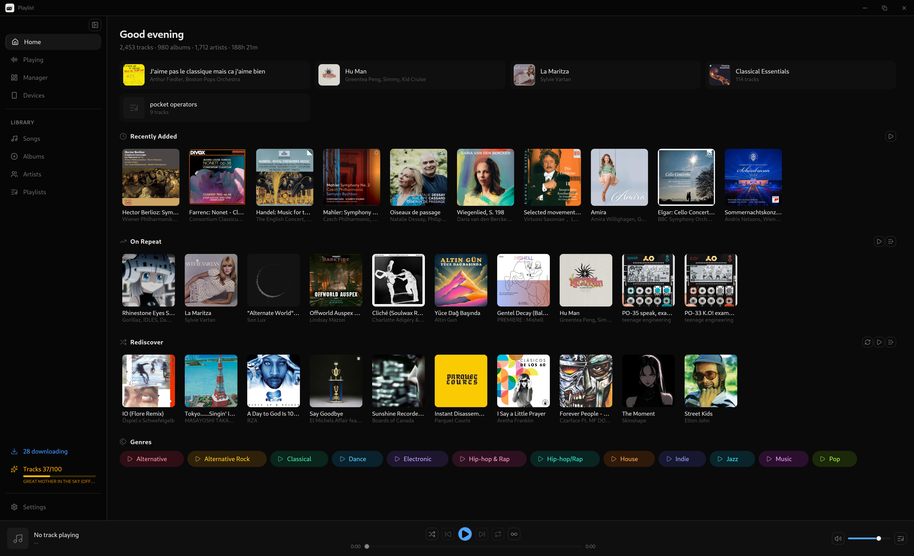

<p align="center">
  
</p>

<h1 align="center">Playlist</h1>

<p align="center">
  <strong>Liberate your music. Own your data. Support artists.</strong>
</p>

<p align="center">
  <a href="https://github.com/sha5b/Playlist/releases/latest"></a>
  <a href="https://github.com/sha5b/Playlist/blob/main/LICENSE"></a>
  
</p>

<p align="center">
  
</p>

---

Streaming platforms decide what you hear, lock your library behind a subscription, and pay artists fractions of a cent. Playlist starts from a simple idea: **your music collection belongs to you, not to a corporation.**

Playlist is a desktop music manager for Windows, macOS, and Linux. It is built with **Tauri 2**, **SvelteKit**, and **Rust**. Download tracks from most platforms, find the albums and tracks your collection misses, and play everything locally. All offline. All yours.

> **Support artists directly.** Buy their albums. Back them on Patreon. Buy them a coffee. Go to their shows. This tool gives you control over your data. Use that freedom to support the people who make the music you love.

---

## Features

| | Feature | Description |
|---|---|---|
| **Download** | From almost anywhere | YouTube, SoundCloud, Bandcamp, and hundreds more via yt-dlp |
| **Discover** | Missing music | Find the missing tracks in your albums, and the missing albums for your artists |
| **Sync** | Across devices | Keep your library identical between machines |
| **Metadata** | Automatic | MusicBrainz and Last.fm enrichment: album art, genres, and more |
| **Playback** | Full local player | Queue, shuffle, repeat, and background playback from the system tray |
| **Library** | Organized your way | Playlists, album views, artist browsing, and full-text search |
| **Platform** | Cross-platform | Windows, macOS, and Linux (deb, rpm, Flatpak) |

---

## Install

Download the latest installer for your platform from the [Releases](https://github.com/sha5b/Playlist/releases/latest) page.

| Platform | Format |
|----------|--------|
| Windows | `.exe` (NSIS installer) |
| macOS | `.dmg` |
| Linux | `.deb`, `.rpm` |

On the first launch, the app downloads yt-dlp and ffmpeg automatically. On each later launch, the app updates yt-dlp so downloads keep working when platforms change.

---

## Build from Source

### Prerequisites

- **Node.js** 20+ and **npm**
- **Rust** 1.77+ (install via [rustup](https://rustup.rs))
- Platform-specific Tauri dependencies — see the [Tauri prerequisites guide](https://v2.tauri.app/start/prerequisites/)

### Development

```sh
npm install          # Install frontend dependencies
npx tauri dev        # Launch in dev mode (Vite + Tauri window)
```

### Production Build

```sh
npx tauri build      # Outputs installer to src-tauri/target/release/bundle/
```

### Flatpak

The Flatpak manifest is at `com.playlist.app.yml`. Use it to build and to publish to Flathub. The build targets GNOME Platform 48 and bundles yt-dlp as a standalone binary.

<details>
<summary><strong>Flatpak build instructions</strong></summary>

#### Prerequisites

```sh
# Install flatpak-builder
sudo dnf install flatpak-builder    # Fedora
sudo apt install flatpak-builder    # Ubuntu/Debian

# Install the SDK and extensions
flatpak install flathub org.gnome.Sdk//48
flatpak install flathub org.freedesktop.Sdk.Extension.rust-stable//24.08
flatpak install flathub org.freedesktop.Sdk.Extension.node22//24.08
```

#### Generate offline dependency manifests

Flatpak builds have no network access. Fetch the dependencies first with [flatpak-builder-tools](https://github.com/flatpak/flatpak-builder-tools):

```sh
pip3 install toml aiohttp

# Generate Cargo sources from lockfile
python3 flatpak-builder-tools/cargo/flatpak-cargo-generator.py \
  src-tauri/Cargo.lock -o cargo-sources.json

# Generate Node.js sources from lockfile
python3 flatpak-builder-tools/node/flatpak-node-generator.py \
  npm package-lock.json -o node-sources.json
```

#### Build and test locally

```sh
flatpak-builder --force-clean build-dir com.playlist.app.yml
flatpak-builder --user --install --force-clean build-dir com.playlist.app.yml
flatpak run com.playlist.app
```

</details>

---

## Architecture

```
src/                        SvelteKit frontend (Svelte 5 + shadcn-svelte + Tailwind v4)
  routes/                   Pages: home, search, library, manager, settings
  lib/api/                  Typed Tauri invoke() wrappers
  lib/stores/               Svelte 5 rune stores
  lib/components/           UI components
src-tauri/                  Rust backend
  src/db/                   SQLite (rusqlite, WAL mode, FTS5 full-text search)
  src/audio/                Audio playback (rodio + symphonia)
  src/download/             Download engine (yt-dlp + ffmpeg)
  src/metadata/             Metadata enrichment (MusicBrainz, Last.fm)
  src/commands/             Tauri IPC command handlers
```

## Tech Stack

| Layer | Technology |
|-------|------------|
| Framework | Tauri 2 |
| Frontend | SvelteKit + Svelte 5 |
| UI | shadcn-svelte + Tailwind CSS v4 |
| Backend | Rust |
| Database | SQLite (WAL mode, FTS5) |
| Audio | rodio + symphonia |
| Downloads | yt-dlp + ffmpeg |
| Metadata | lofty, MusicBrainz, Last.fm |

---

## License

[MIT](LICENSE)
